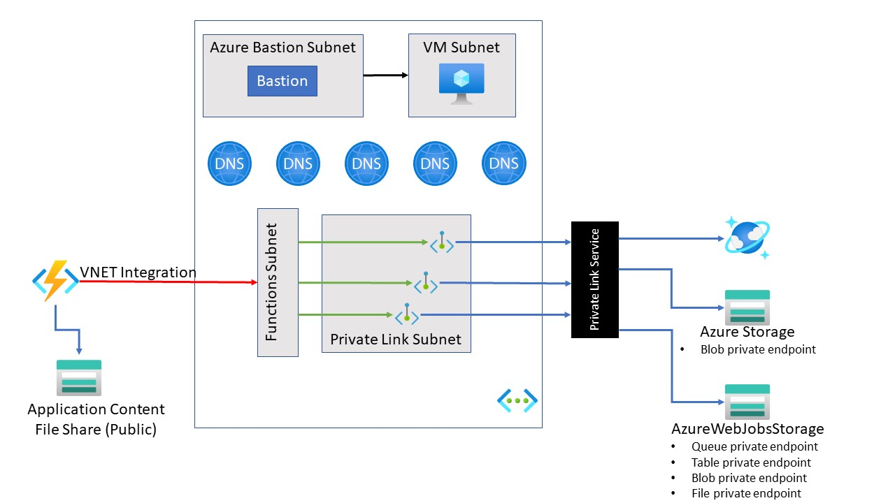

# Azure Functions with a private storage account

:construction: This is still under development! :construction:

This is a sample showing how to set up Azure Functions to use a vnet restricted (private) storage account.  

## Summary

The Azure Function app provisioned in this sample uses an Azure Functions Premium plan.  The Premium plan is used to enable virtual network integration.  Virtual network integration is significant in this sample as a storage accounts used by the function app can only be accessed via private endpoints within the virtual network.

There are four Azure Storage accounts created in this sample:

- two storage accounts use a private endpoint
  - storage account used by the Azure Functions runtime for metadata (as referenced by the [AzureWebJobsStorage](https://docs.microsoft.com/azure/azure-functions/functions-app-settings#azurewebjobsstorage) setting).
  - storage account with a queue
- one storage account with no virtual network restrictions (indicated by the [WEBSITE_CONTENTAZUREFILECONNECTIONSTRING](https://docs.microsoft.com/azure/azure-functions/functions-app-settings#website_contentazurefileconnectionstring) setting) will contain the application code.
- one storage account used by the VM for diagnostics

## Deployment

Execute the [ARM template in the template directory](./template/azuredeploy.json).  A [script](./template/deploy.sh) is provided to deploy the template. The ARM template will provision the following resources:

- Four storage accounts
- Virtual network with three subnets
- Virtual machine within the virtual network.  The VM is used to access private resources on the virtual network.
- Azure Bastion host to access the VM
- Application Insights
- Cosmos DB (with a database and collection). A private endpoint is configured for use with Cosmos DB.
- Azure Functions Premium plan and function app with vnet integration enabled
- Azure Private DNS zones

Credit to Pasi Huuhka [@DrBushyTop](https://twitter.com/DrBushyTop) and the post at https://www.huuhka.net/automating-azure-private-link-storage-private-endpoints/ for the information on using ARM templates to get the IP addresses for the private DNS A records.
